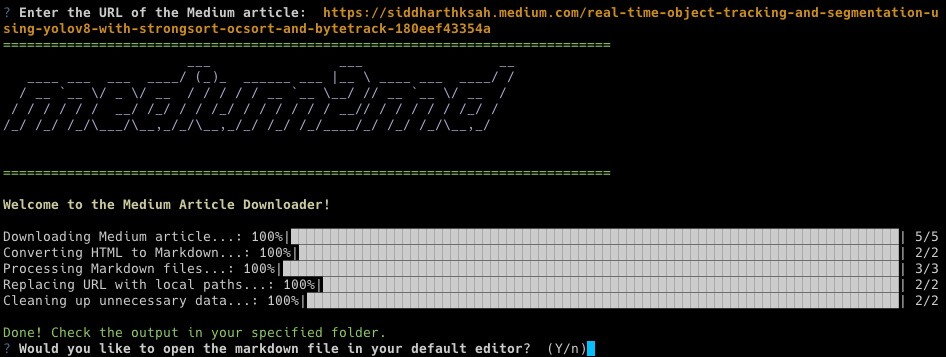

<p align="center">
  <a href="https://github.com/siddharthksah/medium2md/issues"></a>
  <a href="https://github.com/siddharthksah/medium2md/network"></a>
  <a href="https://github.com/siddharthksah/medium2md/stargazers"></a>
  <a href="https://github.com/siddharthksah/medium2md/blob/main/LICENSE.txt"></a>
</p>

Convert your favorite Medium articles into markdown files using `Medium2md`, a powerful and user-friendly command-line tool. Designed in Python, it extends beyond simple conversion to download all images within the article, saving them locally and integrating them into your markdown file seamlessly.

<p align="center">
  
</p>

## Table of Contents

- [Features](#features)
- [Getting Started](#getting-started)
- [Usage](#usage)
- [Project Structure](#project-structure)
- [Contributing](#contributing)
- [License](#license)

## Features

- **Efficient Conversion**: Download Medium articles as HTML and convert them into clean, readable Markdown files.
- **Image Handling**: Download images from the article, save them locally, and update image URLs in the markdown files to point to local paths.
- **Post-Processing**: Automatically clean up unnecessary data after conversion.
- **User-Friendly**: Interactive CLI interface with progress bars and prompts for an enhanced user experience.

## Getting Started

### Prerequisites

- Python 3.8 or later
- Conda

### Installation

1. Clone the repository:

    ```bash
    git clone https://github.com/siddharthksah/medium2md.git
    ```

2. Navigate into the project directory:

    ```bash
    cd medium2md
    ```

3. Create a new conda environment and activate it:

    ```bash
    conda create --name medium2md python=3.8 -y
    conda activate medium2md
    ```

4. Install the package and its dependencies using `setup.py`:

    ```bash
    python3 setup.py install
    playwright install
    ```

   This will automatically install all required packages listed in `setup.py`'s `install_requires` section.


## Usage

Run `medium2md` with:

```bash
python3 src/main.py -u <URL>
```

Replace <URL> with the URL of the Medium article you wish to download. If no URL is provided, the script will prompt you to input one.

When the process is complete, the script will ask if you wish to open the downloaded markdown file in your default editor.

## Output
The converted articles are stored in the output directory, which is created in the project's root directory.

## Unittests

### Running Unittests

To run the unittests for the `Medium2md` project, navigate to the root directory of the project and use the following command:

```bash
python -m unittest discover unittests
```

This will automatically discover and run all the unittests in the unittests directory.

Please ensure that you have installed the required packages for the project by following the installation instructions in the `Getting Started` section.

## 📚 Project Structure
```markdown
.
├── LICENSE.txt
├── README.md
├── docs
├── output
├── requirements.txt
└── src
    ├── __init__.py
    ├── clean_md.py
    ├── clean_unnecessary_data.py
    ├── download_with_media.py
    ├── html_to_md.py
    ├── main.py
    └── url_to_local.py
```

## 🤝 Contributing
We welcome contributions! If you would like to make changes, please submit a pull request. For substantial updates, we request that you open an issue first to discuss the proposed changes.

## 📃 License
`Medium2md` is licensed under the terms of the [MIT License](./LICENSE.txt). For the full text, see the [LICENSE](./LICENSE.txt) file.


