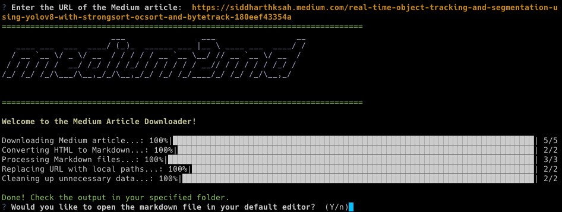

# Medium2md

<p align="center">
  
</p>

`Medium2md` is a powerful and user-friendly command-line tool that empowers you to convert your favorite Medium articles into markdown files. Designed in Python, it doesn't just stop at conversion, but goes a step further to download all images within the article, saving them locally and mapping them accurately in the markdown file.

## 🎯 Features

- Downloads Medium articles and saves them as HTML.
- Converts downloaded HTML articles into clean, readable Markdown files.
- Downloads images within the article, stores them locally, and replaces image URLs in the markdown files with local paths.
- Cleans up unnecessary data after processing.
- Interactive CLI interface with progress bars and prompts.

## 🚀 Getting Started

### Prerequisites

- Python 3.8 or later
- Conda

### Installation

1. Clone the repository:

    ```bash
    git clone https://github.com/siddharthksah/medium2md
    ```

2. Navigate into the project directory:

    ```bash
    cd medium2md
    ```

3. Create a new conda environment and activate it:

    ```bash
    conda create --name medium2md python=3.8
    conda activate medium2md
    ```

4. Install the required Python packages:

    ```bash
    pip install -r requirements.txt
    ```

## 💻 Usage

After installation, you can run `medium2md` with the command:

```bash
python main.py -u <URL>
```

Replace <URL> with the URL of the Medium article you wish to download. If no URL is provided, the script will prompt you to input one.

When the process is complete, the script will ask if you wish to open the downloaded markdown file in your default editor.

## Output
The converted articles are stored in the output directory, which is created in the project's root directory.

## 📚 Project Structure
```markdown
.
├── LICENSE.txt
├── README.md
├── docs
├── output
├── requirements.txt
└── src
    ├── __init__.py
    ├── clean_md.py
    ├── clean_unnecessary_data.py
    ├── download_with_media.py
    ├── html_to_md.py
    ├── main.py
    └── url_to_local.py
```

## 🤝 Contributing
We welcome contributions! If you would like to make changes, please submit a pull request. For substantial updates, we request that you open an issue first to discuss the proposed changes.

## 📃 License
`Medium2md` is licensed under the terms of the MIT License. See the LICENSE file for the full text.

